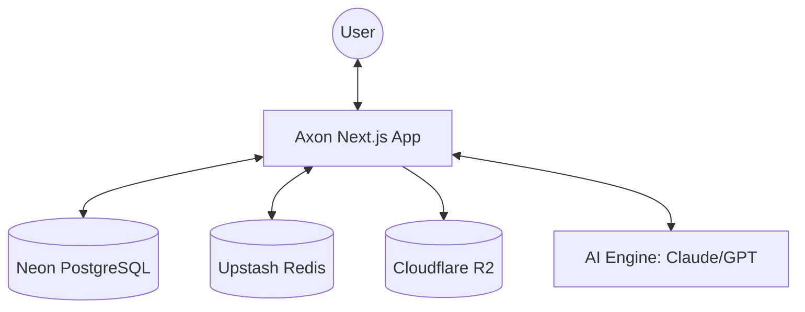

# Axon: The Engineering Knowledge Hub

Axon is an open-source, high-performance platform designed to eliminate knowledge silos within software engineering teams. Inspired by the way neurons transmit vital impulses, Axon acts as the central nervous system for your team's collective brain.

> [!TIP]
> This document is the primary source of truth for the Axon project. For technical implementation details, refer to [coding-standards.md](file:///Users/elhoucineaouassar/Documents/sass/axon/context/coding-standards.md).

---

## 🎯 The Problem

Engineering teams struggle with "knowledge silos" and insecure sharing of sensitive infrastructure data. Critical team assets are currently fragmented:

- **Insecure Secrets**: Shared API keys and secrets in Slack/Discord.
- **Lost Diagrams**: Infrastructure diagrams buried in private Figma files.
- **Outdated Docs**: Onboarding guides in abandoned Wikis.
- **Scattered Runbooks**: Database commands in random Notion pages.
- **Private READMEs**: SSH commands and environment variables in local files.

Axon provides **ONE secure, collaborative, and encrypted hub** for team-wide engineering knowledge and credentials.

---

## 👥 User Personas

| Persona              | Role in Axon                                                          |
| :------------------- | :-------------------------------------------------------------------- |
| **Lead Engineer**    | Standardizes patterns, team prompts, and security protocols.          |
| **DevOps / SRE**     | Manages runbooks, infrastructure commands, and deployment checklists. |
| **Junior Developer** | Accesses snippets, onboarding resources, and "how-we-code" guides.    |
| **Security Officer** | Monitors access to sensitive links and manages secret templates.      |

---

## 🛠 Features

### Item Types

Items are the core building blocks of Axon. System types are immutable:

- `Snippet`: Shared code patterns (React, SQL, Go).
- `Runbook`: Step-by-step terminal commands and instructions.
- `Secret-Ref`: Pointers to external secret stores (KeyVault, AWS Secrets).
- `Doc`: Long-form high-quality documentation.
- `Resource`: Curated internal or external links.
- `Asset`: Architecture diagrams (Team-Pro only).
- `Blueprint`: Reusable project initialization prompts.

### Spaces (Collections)

Items are organized into **Spaces**. An item can belong to multiple Spaces, allowing for dynamic organization.
_Example Spaces: `Onboarding 2026`, `Infrastructure/SRE`, `Frontend Standards`._

### AI-Powered Insights (Team-Pro)

- **Repo-to-Doc**: Generate documentation directly from GitHub URLs.
- **Auto-Runbook**: Convert shell history into documented procedures.
- **Compliance Scanner**: Identify accidentally committed secrets.
- **Knowledge Bridge**: Automatically link related snippets across spaces.

---

## 🏗 System Architecture



---

## 💾 Data Model (Prisma)

Axon uses Prisma 7 with Neon (PostgreSQL) and `pgvector` for semantic search.

```prisma
enum Role { ADMIN; MEMBER; READ_ONLY }
enum ItemType { SNIPPET; RUNBOOK; SECRET_REF; DOC; RESOURCE; ASSET; BLUEPRINT }
enum Visibility { PUBLIC; PRIVATE_TO_TEAM }
enum AuditAction { VIEW; EDIT; DELETE }

model Team {
  id        String   @id @default(cuid())
  name      String
  isPro     Boolean  @default(false)
  users     User[]
  items     Item[]
  spaces    Space[]
  createdAt DateTime @default(now())
  updatedAt DateTime @updatedAt
}

model User {
  id            String     @id @default(cuid())
  email         String?    @unique
  role          Role       @default(MEMBER)
  teamId        String
  team          Team       @relation(fields: [teamId], references: [id])
  itemsCreated  Item[]     @relation("ItemAuthor")
  itemsUpdated  Item[]     @relation("ItemEditor")
  auditLogs     AuditLog[]
  createdAt     DateTime   @default(now())
  updatedAt     DateTime   @updatedAt
}

model Item {
  id             String      @id @default(cuid())
  title          String
  type           ItemType
  content        String      @db.Text
  fileUrl        String?
  isVerified     Boolean     @default(false)
  authorId       String
  author         User        @relation("ItemAuthor", fields: [authorId], references: [id])
  lastEditedById String
  lastEditedBy   User        @relation("ItemEditor", fields: [lastEditedById], references: [id])
  teamId         String
  team           Team        @relation(fields: [teamId], references: [id])
  spaces         ItemSpace[]
  auditLogs      AuditLog[]
  createdAt      DateTime    @default(now())
  updatedAt      DateTime    @updatedAt
}

model Space {
  id          String      @id @default(cuid())
  name        String
  color       String
  visibility  Visibility  @default(PRIVATE_TO_TEAM)
  description String?
  teamId      String
  team        Team        @relation(fields: [teamId], references: [id])
  items       ItemSpace[]
  createdAt   DateTime    @default(now())
  updatedAt   DateTime    @updatedAt
}

model ItemSpace {
  itemId  String
  item    Item    @relation(fields: [itemId], references: [id])
  spaceId String
  space   Space   @relation(fields: [spaceId], references: [id])
  pinned  Boolean @default(false)
  @@id([itemId, spaceId])
}

model AuditLog {
  id        String      @id @default(cuid())
  userId    String
  user      User        @relation(fields: [userId], references: [id])
  itemId    String
  item      Item        @relation(fields: [itemId], references: [id])
  action    AuditAction
  timestamp DateTime    @default(now())
}
```

---

## 🎨 UI/UX Specifications

Axon features a **Brutalist-minimal** interface designed for efficiency.

### Visual Tokens

| Element        | Specification                                    |
| :------------- | :----------------------------------------------- |
| **Theme**      | Midnight (Dark - Default), Monochrome (Light)    |
| **Typography** | `JetBrains Mono` (Code), `Inter` (UI)            |
| **Identity**   | High-contrast, secure "Command Center" aesthetic |

### Type Library

| Type           | Hex Color | Lucide Icon   |
| :------------- | :-------- | :------------ |
| **Snippet**    | `#60a5fa` | `Code2`       |
| **Runbook**    | `#f87171` | `Terminal`    |
| **Secret-Ref** | `#fbbf24` | `ShieldCheck` |
| **Doc**        | `#a78bfa` | `FileText`    |
| **Resource**   | `#34d399` | `Globe`       |
| **Asset**      | `#94a3b8` | `Paperclip`   |
| **Blueprint**  | `#6366f1` | `Layout`      |

### Screenshots

Refer to the screenshots belowe as a base for the dashboard UI. It does not have to be the exact same. Use it as a reference.

- @context/screenshots/dashboard-main.png
- @context/screenshots/dashboard-drawer.png

---

## 💰 Monetization

| Feature     | Free Tier | Team-Pro ($15/mo) |
| :---------- | :-------- | :---------------- |
| Users       | Up to 5   | Unlimited         |
| Items       | 100 total | Unlimited         |
| File Assets | ❌        | 10GB Storage      |
| AI Tools    | ❌        | ✅                |
| SSO / SAML  | ❌        | ✅                |
| Audit Logs  | Basic     | Full Retention    |

---

## 🚀 Tech Stack

- **Framework**: Next.js 16 / React 19 (App Router)
- **Database**: Neon (PostgreSQL) + pgvector
- **ORM**: Prisma 7
- **Caching**: Redis (Upstash)
- **Auth**: Auth.js (Next-Auth v5)
- **Styling**: Tailwind CSS v4 + ShadCN UI
- **Storage**: Cloudflare R2

---

## 📝 Open Questions & Decisions

> [!IMPORTANT]
> The following items require architectural decisions or UX clarification.

### Architecture & Data

- **Multi-workspace support**: Can a user belong to multiple teams? (Likely needed for agencies/consultants).
- **Compliance Checker scope**: Should it scan on save only, or be a background job over all existing items?
- **Deletion policy**: Soft delete with a grace period, or immediate hard delete?

### Features & UX

- **Custom item types**: The spec mentions "System/Custom" but the custom type UX is currently undefined.
- **Mobile / Responsive**: How should the three-pane layout collapse on mobile? (e.g., single column with a navigation overlay).

### Business & Infrastructure

- **API rate limits**: Define per-plan limits for CI/CD API access.
- **R2 storage allocation**: Is the 10GB limit a shared pool per team or per seat?
